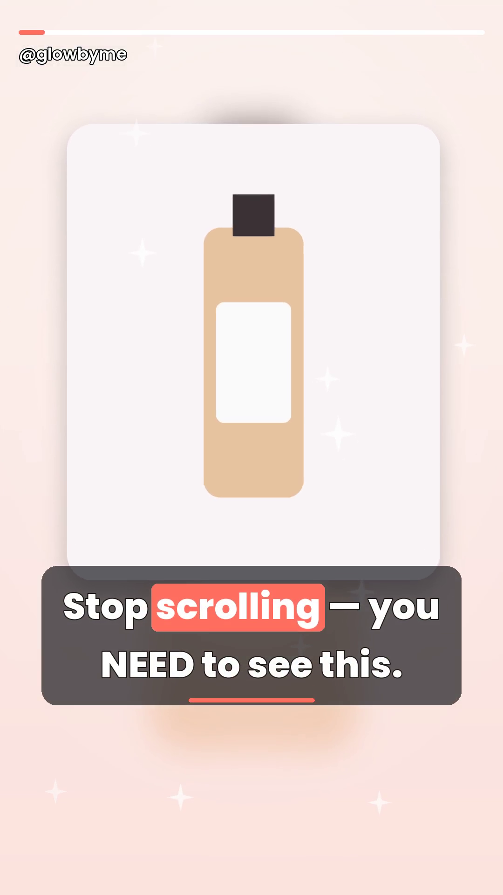

# ✨ TikTok Shop Ad Maker

Upload a product photo → get a **ready-to-post vertical ad video** (9:16) for
TikTok Shop, saved to a folder on your own computer. Built for affiliates, and
tuned for **beauty, cosmetics, and women's everyday products**.

It writes the ad script for you (hook → benefits → call-to-action), adds a free
voiceover, animates your product photo, and burns on clean captions. You can
**edit every word** before it renders.

---

## 🟢 Please read this first (honest expectations)

I want you to succeed, so here's the plain truth about what this does:

- ✅ **Makes a real, good-looking ad video from one photo — 100% free.** Script,
  voiceover, animation, captions, music mixing. No subscriptions, no API keys.
- ✅ **Saves everything locally.** Nothing is uploaded anywhere. Your photos and
  videos stay on your machine.
- ✅ **Works for any product**, with extra polish for cosmetics / skincare /
  makeup / women's daily needs.
- ⚠️ **"Auto-find product data from just a photo"** truly well needs a paid AI
  service. So instead, the app **writes the script from the product name +
  category you pick**, and lets you **edit every line** (this is actually more
  accurate — you stay in control). If you later get an Anthropic API key, it can
  also *look at the photo* and draft the copy for you (optional, see below).
- ⚠️ **A realistic AI "human presenter"** (a person talking on camera) needs a
  paid avatar service like HeyGen or D-ID. That option is in the app and ready
  to plug a key into, but **for free it falls back to the animated style** —
  which performs great on TikTok Shop.

So: the **animation style is the free, fully-working core**, and it's genuinely
good. The human-presenter is an optional paid upgrade you can add anytime.

---

## ▶️ How to run it (step by step)

You need a **computer** (Windows or Mac) and **Python 3.10+** installed once.
Get Python from <https://www.python.org/downloads/> — on Windows, **tick
"Add Python to PATH"** during install.

### Windows
1. Download/clone this folder onto your computer.
2. Double-click **`start-windows.bat`**.
3. The first run installs everything (a few minutes). Then your browser opens
   automatically at `http://127.0.0.1:5000`.

### Mac / Linux
1. Open **Terminal** in this folder.
2. Run: `bash start-mac-linux.sh`
3. First run installs everything, then your browser opens automatically.

> Keep the little black/terminal window open while you use the app. Close it to stop.

---

## 🪄 How to make a video

1. **Upload** your product photo (a clean photo on a plain background works best).
2. Type the **product name** and pick the **category** (e.g. Skincare).
   Optionally add a short description, your `@handle`, a price, voice & tone.
3. Click **"Write my ad script"** — you'll get a full script.
4. **Edit any line** you want (the text you type is exactly what's spoken *and*
   shown on screen).
5. Click **"🎬 Make my video"**. In under a minute you'll get a preview.
6. **Download** the video, and the **caption + hashtags** (saved as a `.txt`).

Your videos are saved in the **`output/`** folder inside this app.

---

## 💡 Tips to get more sales on TikTok Shop

- **Add a trending sound in the TikTok app** after uploading — it boosts reach,
  and your voiceover is kept. (So you usually don't even need background music.)
- Post consistently (1–3x/day), hook viewers in the **first 2 seconds** (the app
  does this for you).
- Use the **caption + hashtags** from the generated `.txt` file.
- Tag the product from TikTok Shop so the **orange cart** shows on your video.
- Try a few **different scripts** for the same product and see what performs.

---

## ⚙️ Optional extras

**Background music** — drop one music file into `assets/music/` and tick
"Add background music". Use royalty-free music (see `assets/music/README.txt`).

**Video styles** — in "More options" you can pick:
- **Dynamic Animation** (recommended): smooth motion, highlighted keywords, soft sparkles.
- **Bold & Hype**: bigger zoom and more sparkle/energy — great for hooking fast scrollers.
- **Clean Showcase**: slower and elegant — nice for premium/luxury products.
- **AI Human Presenter**: needs a paid avatar add-on (falls back to animation for now).

**Different voices / tones** — pick from the "More options" menu. Voices are free
(Microsoft Edge voices) and need an internet connection. No internet? The app
still makes the video with captions (and tries your computer's built-in voice).

**AI script from the photo (optional, paid)** — if you have an Anthropic API key,
set it before you start the app, and it will read your photo and draft tailored
copy (the `anthropic` library is already installed for you):

- Windows (in the black window before it starts): `set ANTHROPIC_API_KEY=your-key`
- Mac/Linux: `export ANTHROPIC_API_KEY=your-key`
- Then start the app as usual. You'll see an "AI" checkbox in More options.

**AI human presenter (optional, paid)** — to enable a real talking avatar, you'd
add a HeyGen/D-ID account + key. The "AI Human Presenter" option is wired to fall
back to animation until that's configured. (Ask for help wiring it when you're
ready.)

---

## 🆘 Troubleshooting

- **"Python is not installed"** → install Python 3.10+ and tick *Add to PATH*
  (Windows), then run the start file again.
- **First run is slow** → it's downloading components once; later runs are fast.
- **No voiceover / "captions only" message** → you were offline. Connect to the
  internet and generate again for a spoken voiceover.
- **Video looks plain** → use a higher-quality product photo; photos on a clean
  white or simple background look most professional.
- **It won't open in the browser** → manually go to `http://127.0.0.1:5000`.

---

## 🔒 Privacy
Everything runs on your computer. The only internet use is: downloading
components on first install, and the free voiceover service while generating
(and the optional AI, only if you turn it on). Your images and videos are never
uploaded.

Made with care. You've got this 💖
